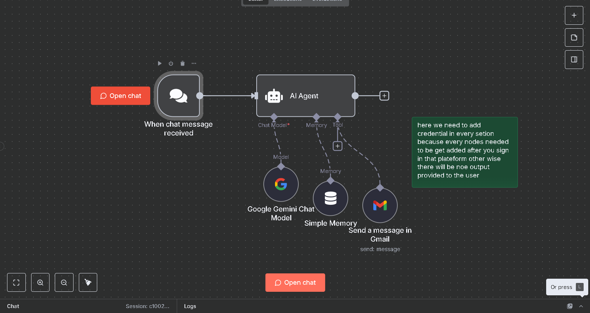

# n8n Agents

This repository contains my custom **n8n workflows (agents)** built during my learning and projects.

## 📌 Current Agents

### 1. Email Assistant Agent
- Built using **Google Gemini** + **Gmail Integration**
- Helps write and send professional emails automatically
- Handles user prompts and replies in JSON format

File: [`email-assistant.json`](./email-assistant.json)

## 🚀 How to Use
1. Open your n8n instance
2. Go to **Import Workflow**
3. Upload the `.json` file (e.g. `email-assistant.json`)
4. Configure your credentials (Google Gemini + Gmail) inside n8n
5. Activate and run 🚀

## 📸 Workflow Screenshot

---

⭐ If you find this useful, give the repo a star!
